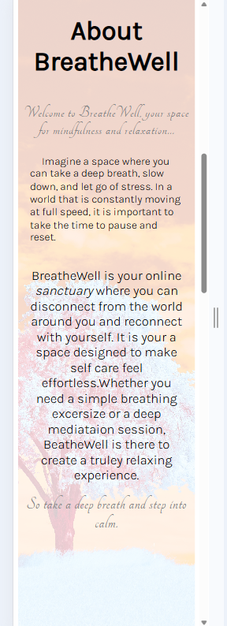
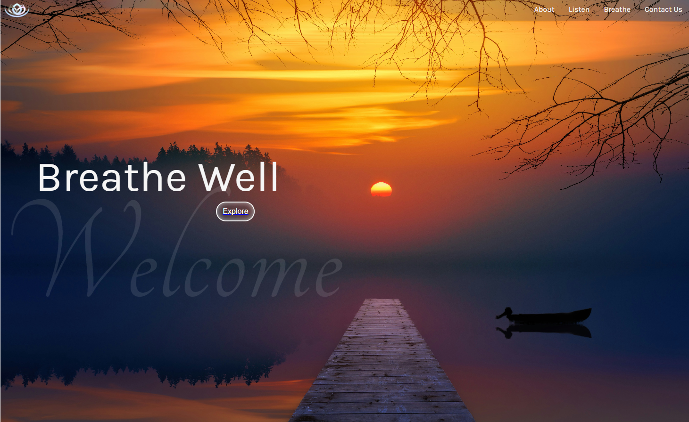
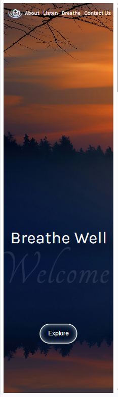
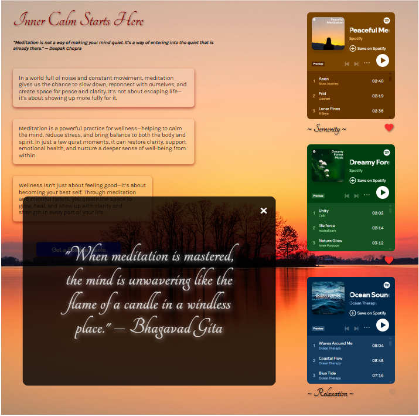

# Project BreathWell

**Description:**

Welcome to BreatheWell, your digital sanctuary for cultivating inner peace through meditation, mindfulness, and breathing exercises. Designed to promote relaxation and holistic well-being, this interactive platform guides users through techniques that encourage self-care and stress relief.

**Website Features**

Breathing Exercises: Practice calming breathing techniques to reduce stress and improve focus.
Embedded Spotify Experience: Immerse yourself in relaxation with seamlessly integrated meditation playlists, playable directly within the platform for an uninterrupted wellness journey.
Responsive Design: to ensure functionality across different devices

## Project feautures

- Semantic HTML5
- Flexbox
- Positioning
- Flat BEM file structure
- A custom form
- Responsive design
- CSS @imports
- CSS @media queries
- Primary and fallback fonts
- Mobile Optimzation
- Figma
- Hover and transition properties
- JavaScript

## Deployment & System Requirements

## Local installation and Usage

## Deployment

## Images

